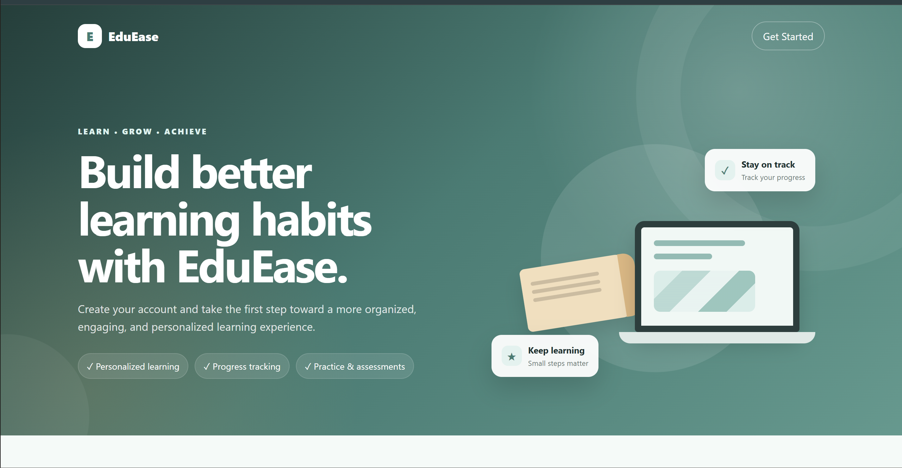
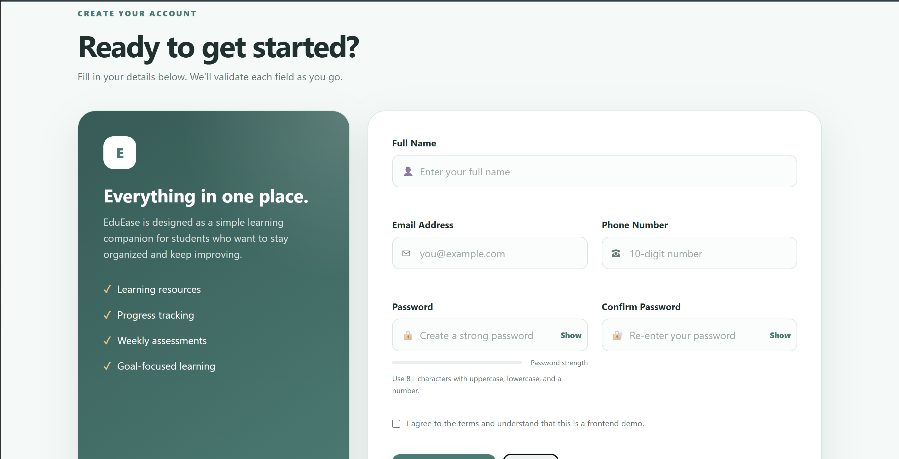
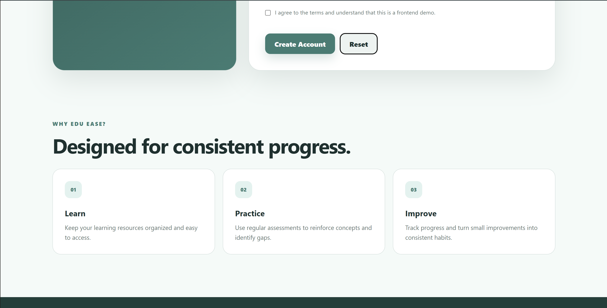

# 🎓 EduEase — Form Validation Website

A responsive educational landing page with a registration form built using **HTML, CSS, and Vanilla JavaScript**.

The project focuses on client-side form validation, responsive UI design, user feedback, and clean frontend structure.

## ✨ Features

- Responsive educational landing page
- Registration form with:
  - Full name validation
  - Email validation
  - 10-digit phone validation
  - Password validation
  - Confirm-password matching
  - Terms acceptance
- Real-time validation feedback
- Password strength indicator
- Show/hide password controls
- Invalid/valid input states
- Reset form functionality
- Success state after valid submission
- Mobile-responsive layout
- CSS-only decorative hero illustration
- No backend or installation required
- No machine-specific Windows file paths
- No external icon library required

## 🛠️ Technologies

- HTML5
- CSS3
- Vanilla JavaScript
- CSS Grid & Flexbox
- Regular expressions for input validation

## 📁 Project Structure

```text
form-validation/
│
├── assets/
│   └── hero.png
│   └── form-validation.png
│   └── features.png
│
├── index.html
├── form2.css
├── form3.js
└── README.md
```

## 🚀 Getting Started

No packages, frameworks, or build tools are required.

### 1. Clone the repository

```bash
git clone https://github.com/Mansi422-dot/form-validation.git
```

### 2. Enter the project directory

```bash
cd form-validation
```

### 3. Run the project

Open `index.html` directly in a browser.

For a better development experience, open the folder in VS Code and use the Live Server extension.

## 🔐 Validation Rules

### Full Name
- Required
- Minimum 5 characters
- Accepts letters and common name characters

### Email
- Required
- Must follow a basic email format

### Phone Number
- Required
- Exactly 10 digits
- Rejects obvious placeholder numbers

### Password
- Minimum 8 characters
- At least one lowercase letter
- At least one uppercase letter
- At least one number
- Cannot simply be `password`
- Cannot be identical to the user's name

### Confirm Password
- Must match the password exactly

### Terms
- Must be accepted before successful validation

## 📸 Preview

### Hero Section

<div align="center">
  
</div>

### Registration & Validation Form

<div align="center">
  
</div>

### Learning Features Section

<div align="center">
  
</div>

## 🧠 What I Learned

This project helped me practice:

- Semantic HTML structure
- Responsive web design
- CSS Grid and Flexbox
- DOM manipulation
- JavaScript event listeners
- Client-side form validation
- Regular expressions
- Real-time user feedback
- Password-strength evaluation
- Accessible form labels and error messaging
- Responsive UI development

## ⚠️ Important Note

This project performs **client-side validation only**.

It does not send registration information to a backend or create real user accounts. In a production application, validation must also be performed securely on the server before accepting user data.

## 🔮 Future Improvements

Possible future improvements include:

- Backend registration API
- Secure password hashing
- Database integration
- Authentication and login
- Email verification
- Persistent user accounts
- Server-side validation
- Stronger accessibility testing
- Automated frontend tests

## 👩‍💻 Author

**Mansi Karpe**

Cybersecurity student interested in software development, web security, and practical application security.

---

⭐ If you found this project useful, consider giving the repository a star.
